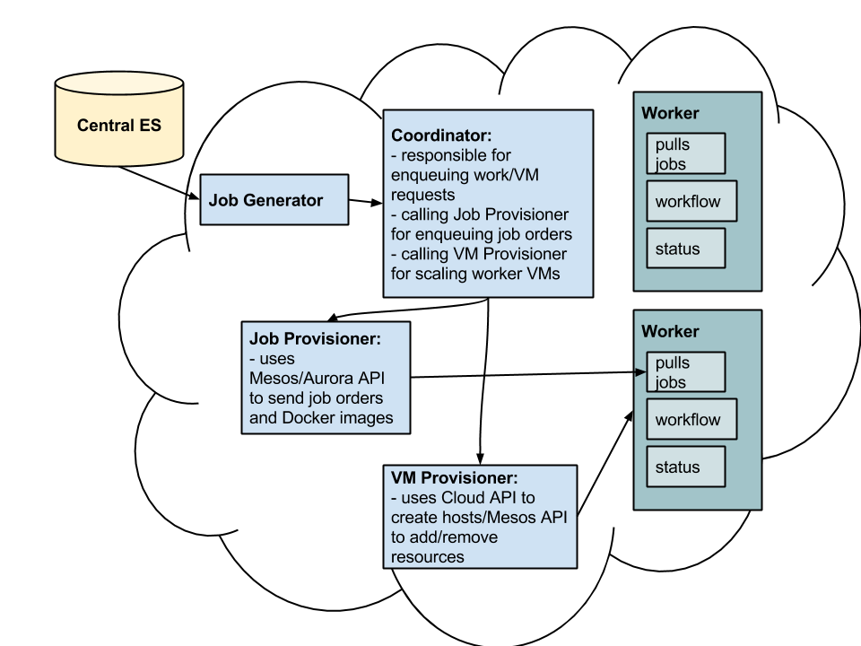
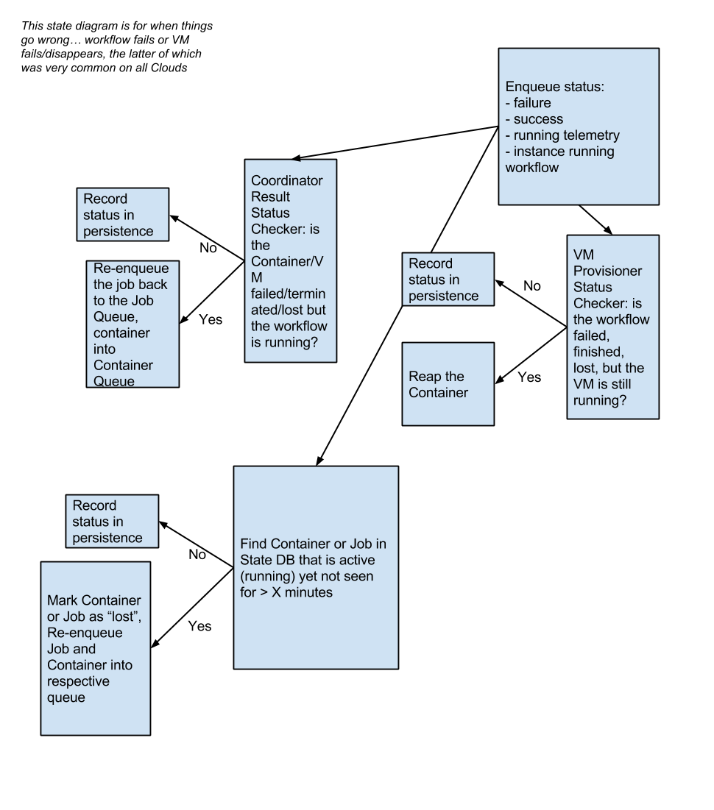
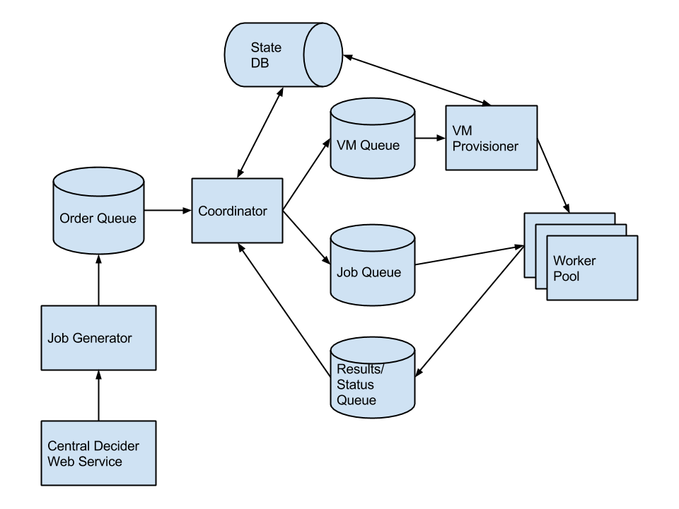
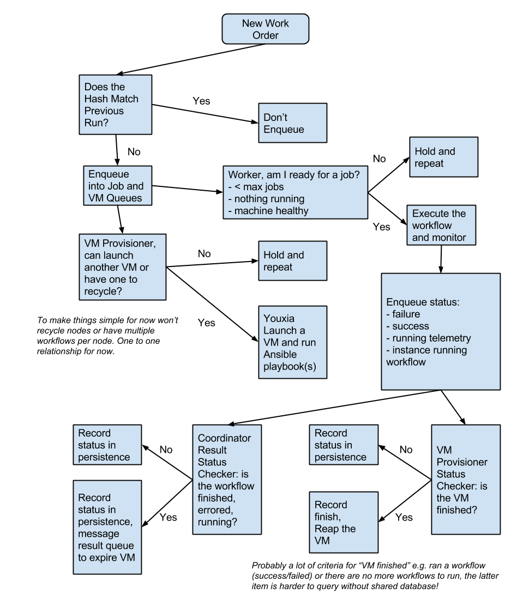

# PanCancer Architecture 3.0 Prototype

## About

The idea behind this architecture is described in more detail elsewhere but the basic idea is a lightweight
framework to run Docker containers for the PanCancer project.

## Building

Just a Java maven project so do the following:

    mvn clean install

## Dependencies

Eventually we will want everything in a single (or series) of Docker containers. This
will make it much easy to redistribute but, for the time being, these can be installed
on your development host directly.

I'm focused on development on a Mac using HomeBrew, you will need to setup
the dependencies using whatever system is appropriate for your environment.

### Ubuntu 14.04

For RabbitMQ see: https://www.rabbitmq.com/install-debian.html

You need to setup the management plugin: https://www.rabbitmq.com/management.html

You will also need `/usr/local/sbin/rabbitmqadmin` installed, see https://www.rabbitmq.com/management-cli.html

    wget -O - -q http://localhost:15672/cli/rabbitmqadmin > /usr/local/sbin/rabbitmqadmin

Finally, for multi-host setups you need to create and user a user:

    sudo rabbitmqctl add_user queue_user queue
    sudo rabbitmqctl set_permissions queue_user ".*" ".*" ".*"
    sudo rabbitmqctl set_user_tags queue_user administrator

For Postgres see:  https://www.digitalocean.com/community/tutorials/how-to-install-and-use-postgresql-on-ubuntu-14-04

### Log4J + Logstash

I'm trying to follow this guide for using Log4J so I can easily incorprate with LogStash in the future: [guide](https://blog.dylants.com/2013/08/27/java-logging-creating-indexing-monitoring/).

### RabbitMQ

See [install guide](https://www.rabbitmq.com/install-homebrew.html)

Basically you do:

    brew update
    brew install rabbitmq
    /usr/local/sbin/rabbitmq-server

And at that point the service is running.

You can view a web GUI at:

    http://localhost:15672

### PostgreSQL

Install with Homebrew

    brew install postgresql

Now launch it:

    postgres -D /usr/local/var/postgres

Now create a user:

    # using 'queue' as the password by default
    boconnor@odm-boconnor ~$ createuser -P -s -e queue_user
    Enter password for new role:
    Enter it again:
    CREATE ROLE queue PASSWORD 'md5f8ceabb22d9297bd28382151f35a2252' SUPERUSER CREATEDB CREATEROLE INHERIT LOGIN;

Now create a DB:

    createdb queue_status

Setup a schema for the DB:

    psql -h 127.0.0.1 -U queue_user -W queue_status < sql/schema.sql

Connect to the DB if you need to:

    psql -h 127.0.0.1 -U queue_user -W queue_status

Delete the contents if you want to reset:

    delete from job; delete from provision;

Drop the DB if you need to clear it out:

    dropdb queue_status
    createdb queue_status

## Testing Locally

The following will let you test on a local box. This simulates a multiple machine/VM
setup on a single box just using Java and RabbitMQ.  Eventually, this will just
be one of multiple possible backends configured by the settings file. This single-machine,
pure Java running example will be used for integration and other tests.

You should also create a ~/.youxia/config file. See https://github.com/CloudBindle/youxia#configuration for an example. 

### Job Generator

This generates job orders, 5 in this case. If you leave off the `--total-jobs` option it will submit jobs on an infinite loop.

    java -cp target/pancancer-arch-3-*.jar info.pancancer.arch3.jobGenerator.JobGenerator --config conf/config.json --total-jobs 5 --workflow-name HelloWorld --workflow-version 1.0-SNAPSHOT --workflow-path /workflows/Workflow_Bundle_HelloWorld_1.0-SNAPSHOT_SeqWare_1.1.0

To generate a real job from an ini file in the directory real\_test:

    java -cp target/pancancer-arch-3-*.jar info.pancancer.arch3.jobGenerator.JobGenerator --workflow-name DEWrapper --workflow-version 1.0.2 --workflow-path /workflows/Workflow_Bundle_DEWrapperWorkflow_1.0.2_SeqWare_1.1.0 --config conf/config.json  --ini-dir real_test/

Note that the job generator supports hashing to prevent submission of ini files already known to the system. See the [config file](conf/config.json) for details. Note that jobs have to be processed by the coordinator before this check will function.  

### Coordinator

This consumes the jobs and prepares messages for the VM and Job Queues.

It then monitors the results queue to see when jobs fail or finish.

Finally, for failed or finished workflows, it informs the Container provisioner about finished
VMs that can be terminated.

    java -cp target/pancancer-arch-3-*.jar info.pancancer.arch3.coordinator.Coordinator --config conf/config.json [--endless]

### Container Provisioner

This will spin up containers that will launch Workers.

    java -cp target/pancancer-arch-3-*.jar info.pancancer.arch3.containerProvisioner.ContainerProvisionerThreads --config conf/config.json [--endless]

### Worker

If you need to create a worker, use the following Ansible playbook https://github.com/ICGC-TCGA-PanCancer/container-host-bag

    java -cp target/pancancer-arch-3-*.jar info.pancancer.arch3.worker.Worker --config conf/config.json --uuid 1234 [--endless]

#### Test Mode Worker

    The test mode worker simply consumes a job and sends back results without running anything. This is used to test the basic lifecycle of our components. 

    java -cp target/pancancer-arch-3-*.jar info.pancancer.arch3.worker.Worker --config conf/config.json --uuid 1234 --test

### Checking Results

Log into the DB and do:

    queue_status=# select * from provision; select job_id, status, job_uuid, provision_uuid, job_hash from job;

### Upgrade SOP

To upgrade from one version of arch3 to a newer version, the simplest approach is to slowly tear down hosts managed by one version by cutting off jobs sent to it while spinning up a new launcher. 

Step-by-step:

1. Terminate the cron task that you have which is running the JobGenerator (thus preventing new jobs from entering the system)
2. Spin up a new set of these components (you may have the option of using the [pancancer launcher](https://github.com/ICGC-TCGA-PanCancer/pancancer_launcher) , if so use the instructions there). Remember to use a new managed\_tag in your ~/.youxia/config in order to prevent clashes where your two clusters attempt to manage each others nodes. 
3. Create a cron task in order to run the JobGenerator in your new cluster
4. When all tasks drain from your old cluster, terminate the launcher and any failed nodes via the AWS console or OpenStack's dashboard. 

## Testing on AWS

WORK IN PROGRESS

In this test I will create a single node for running this framework and associated daemons and a single worker node that actually runs the worker thread and performs some docker workflow run.

### Job Generator

This generates actual job orders using INI files provided by Adam's centralized decider and some command line options.

The first step is to use Adam's command line tool to generate one or more INI files.  See https://github.com/ICGC-TCGA-PanCancer/central-decider-client for details on how to use this.  It's not difficult but you need to follow these steps to have INI files for the next step below.

Now that you have INI files, the next step is to run this command line tool.  It will parse the INI files and generate a job with them and other information it takes from the command line.  It then submits the job "order" to the order message queue.

    java -cp target/pancancer-arch-3-*.jar info.pancancer.arch3.jobGenerator.JobGeneratorDEWorkflow --config conf/config.json --ini-dir <directories_with_ini_files> --workflow-name <workflow_name> --workflow-version <workflow_version> --workflow-path <workflow_path> 
    
    # for example:
    java -cp target/pancancer-arch-3-*.jar info.pancancer.arch3.jobGenerator.JobGeneratorDEWorkflow --config conf/config.json --ini-dir ini --workflow-name DEWrapper --workflow-version 1.0.1-SNAPSHOT --workflow-path /workflow/Workflow_Bundle_DEWrapperWorkflow_1.0.1-SNAPSHOT_SeqWare_1.1.0
    # alternatively for hello world
    java -cp target/pancancer-arch-3-*.jar info.pancancer.arch3.jobGenerator.JobGeneratorDEWorkflow --config conf/config.json --ini-dir /home/ubuntu/gitroot/central-decider-client/ini --workflow-name HelloWorld --workflow-version 1.0-SNAPSHOT --workflow-path /workflow/Workflow_Bundle_HelloWorld_1.0-SNAPSHOT_SeqWare_1.1.0
    

### Coordinator

This consumes the jobs and prepares messages for the VM and Job Queues.

It then monitors the results queue to see when jobs fail or finish.

Finally, for failed or finished workflows, it informs the Container provisioner about finished
VMs that can be terminated.

    java -cp target/pancancer-arch-3-*.jar info.pancancer.arch3.coordinator.Coordinator --config conf/config.json

### Container Provisioner

This will spin up (fake) containers that will launch Workers.

    java -cp target/pancancer-arch-3-*.jar info.pancancer.arch3.containerProvisioner.ContainerProvisionerThreads --config conf/config.json

### Worker

The ContainerProvisioner above is actually pulling jobs using embedded worker threads (this will not be the case for production, instead the above will just launch VMs).  The below can be started on another VM and will compete for jobs from the job queue.  If you run on a different box than the above components make sure the conf/config.json is updated to point to the correct `rabbitMQHost`.

    java -cp target/pancancer-arch-3-*.jar info.pancancer.arch3.worker.Worker --config conf/config.json --uuid 50f20496-c221-4c25-b09b-839511e76df4

You can generate a UUID here: https://www.guidgenerator.com/online-guid-generator.aspx

### Checking Results

Log into the DB and do:

    queue_status=# select * from provision; select job_id, status, job_uuid, provision_uuid, job_hash from job;

## Cleanup

To cleanup and delete all queues and DB tables:

    bash scripts/cleanup.sh

You can use this in your testing to reset the system but keep in mind the danger of using this in production systems where you want to save your DB.  Backup accordingly!

## Diagrams

## FAQ

### Calling Docker within Docker

When running SeqWare in a docker container, there are tricky aspects to running workflows which contain docker steps within them. One issue that we ran into is this, when exposing a client inside a nested docker container to the docker daemon on the hosting VM (or server), volume mounts are resolved from the host. They are not resolved from the first docker container. 

A code example on the command-line. 

    user@host:~/testing/arena$ docker run --rm -h master -it -v /var/run/docker.sock:/var/run/docker.sock seqware/seqware_whitestar_pancancer /bin/bash
    seqware@master:~/pancancer-bag$ pwd                                   (this is within the first container) 
    /home/seqware/pancancer-bag
    seqware@master:~/pancancer-bag$ docker run -i -t  -v `pwd`/shared_workspace/inputs:/workflow_data -v `pwd`/test:/root/test seqware/pancancer_upload_download /bin/bash
    root@6182a4bcab9d:/# ls /root/test                                    (this is within the second container)
    root@6182a4bcab9d:/# touch /root/test/oogly                           (this creates the file, not in the first container, but on the host filesystem)                                (this exits the first container)
    root@6182a4bcab9d:/# exit
    exit
    seqware@master:~/pancancer-bag$ ls test                            
    ls: cannot access test: No such file or directory
    seqware@master:~/pancancer-bag$ exit                                  (this exits the second container)
    exit
    user@host:~/testing/arena$ ls /home/seqware/pancancer-bag/test        (this is where the file ended up on the host)
    oogly

## TODO

### Soon

* test failure propogation... I had DEWrapper fail but the DB was updated with success!
* need to detect lost jobs and handle them appropriately -- DONE
* need an option to prevent jobs from being re-queued if their hash is in the DB -- DONE, now in config file
* in particular, what happens when a host crashes?  Does the job get re-enqueued automatically? -- DONE
    * yes, a crashed host is automatically re-enqueued if the wrapper process is terminated. However, just network timeout I'm not sure.  Mostly failures seem to re-enqueue so another worker will pick up and eventually change the status from lost to running again.
* ---
* better error checking
* improve logging
* cleanup of queue and DB handles
* reporting tool that shows a summary of the DB contents including Donor/Project
* implement heartbeat
    * stderr/stdout in each heartbeat, a configurable number of tailed lines
* test multiple types of failures and code appropriately 
* Solomon wants a "workflow\_path" added to the order -- DONE
* figure out impl/extends class strategy for the various components so they can be  swapped out with different implementations -- TODO, Solomon?
    * worker threads
    * workers that fail, are successful, etc
    * flesh out worker to run docker and provide heartbeat, resources, etc
* finalize the message format between the layers, serializers -- DONE
* pick a storage mechanism for state used by the VMProvisioner and Coordinator -- DONE
* lifecycle of jobs -- DONE
    * enqueue, monitor, launch VMs, status, etc
    * see diagram

### Future

* utilities for clearing the status persistence storage and the message queues if you need to "start over" -- DONE
* really great logging/reporting that's human readable
* ability to turn off the VMProvisioner in case a human makes the worker nodes -- DONE
* log files loaded into the ELK stack for visualization
* Docker container for the system, integration with Architecture Setup 3.0
* need job queues with different names based on the workflow and version they target, this will make it easier to run multiple workflow types at the same time
